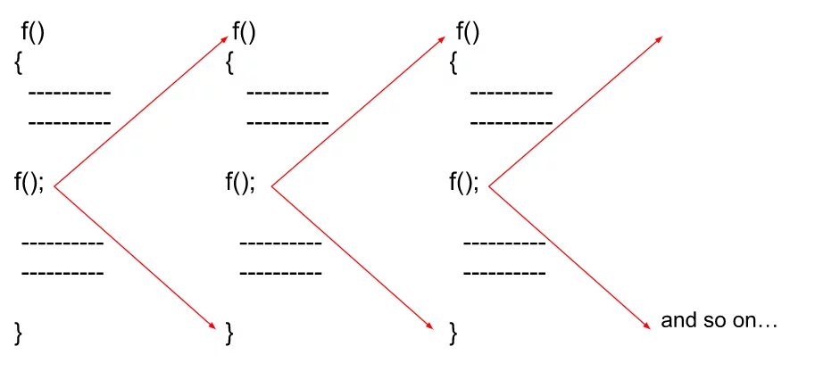

## What is Recursion?

It is a phenomenon when a function calls itself indefinitely until a specified condition is fulfilled.

Let’s understand recursion with the help of an illustration : 

As we can see in the above image, a function is calling the same function inside its body. Since there is no condition to stop the recursive calls, the calls will run indefinitely until the stack runs out of memory ( stack overflow ).

## What is Stack Overflow in Recursion?

Whenever recursion calls are executed, they’re simultaneously stored in a recursion stack where they wait for the completion of the recursive function. A recursive function can only be completed if a base condition is fulfilled and the control returns to the parent function. 

But, when there is no base condition given for a particular recursive function, it gets called indefinitely which results in a Stack Overflow i.e, exceeding the memory limit of the recursion stack and hence the program terminates giving a Segmentation Fault error. 

## Base Condition

It is the condition that is written in a recursive function in order for it to get completed and not to run infinitely. After encountering the base condition, the function terminates and returns back to its parent function simultaneously.

## Recursive Tree

A recursive tree is basically a representative form of recursion which depicts how functions are called and returned as a series of events happening consecutively. It is a pictorial description of the process of recursion as illustrated below : 

When a recursive call gets completed, the control returns back to its parent function which is then further executed until the last function waiting in the recursive stack returns.